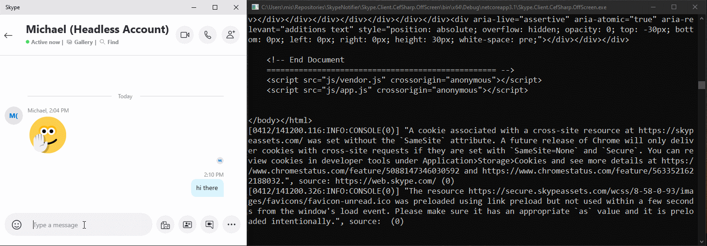

# Skype Client
Skype Client is a C# library that allows hosting a Skype Client in .NET Core. It bases on CEFSharp (CEF Browser) to estabish a Skype client session.

## Feature Set
The library is still under heavy development and should be considered as PoC. The following functionalities are suppored:

| Functionality      | Status | Details |
| -------------      | ---    | ------------------------------- |
| Login			     | ✔️     | E-Mail adress and password 
| Contacts           | ✔️     | Minimalistic list without user details 
| Recieving Messages | ✔️     | Only text messages are supported 
| Sending Messages   | ✔️     | Only text messages are supported  
| Audio, Video Call  | 🚧     | Only call notifications are available 
| Call Updates       | ✔️     | Events for missed, active, ended, declined calls 

## Demo
In the current state the application provides console output for incoming messages and calls, as seen below

The shown demo can be found in `Skype.Client.Demo` project

## Installation!
After you clone the repo, go to Project > Properties > Configurationg Properties > Configuration
and change all to x64.
go to Project > Properties > Common Properties > Startup Project > Single Startup project to Skype.Client.Demo
Then rebuild the solution and thats all

## Acknowledgements
This project is based on 
* Newtonsoft Json.NET (MIT)
* CEFSharp (BSD)
